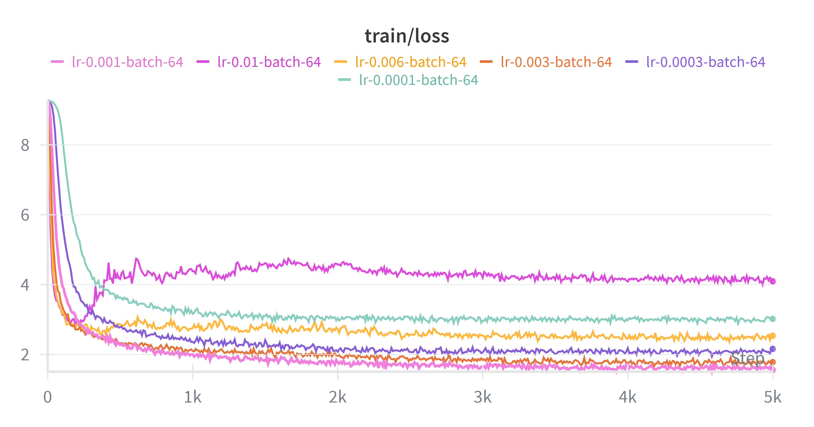
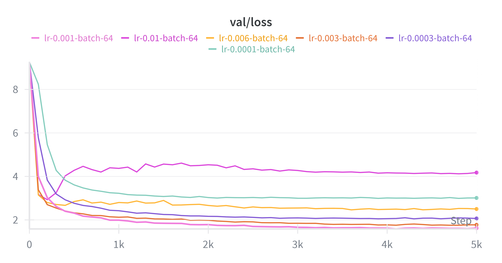
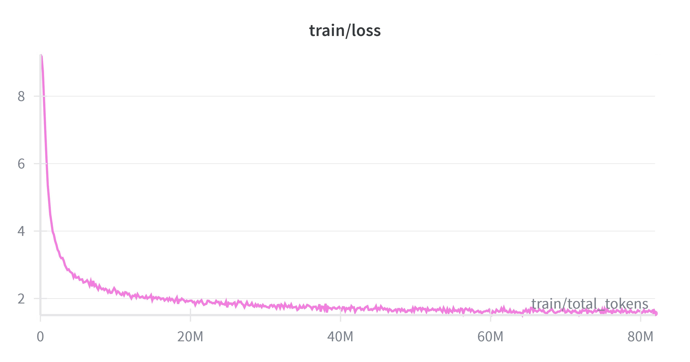
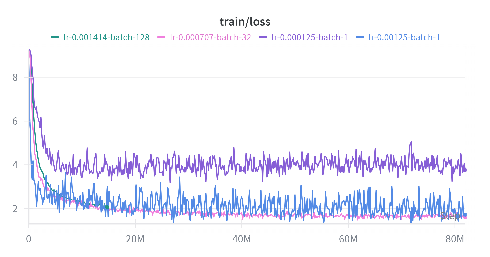
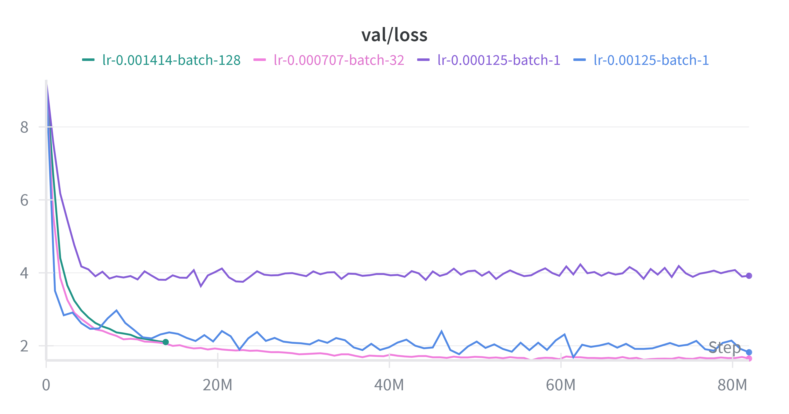

# BPE
## BPE traing
- 实现过程中参考了以下文章：[CS336 Lab 1 实验笔记](https://www.zhouxin.space/notes/notes-on-cs336-lab-1/)
- 注意点
  - 使用cProfile测量性能
  - 使用tqdm监控过程
  - 尽量注明类型
  - 先实现后优化

- 大致步骤：
	- 初始化 **Vocabulary**，`vocabulary: dict[int, bytes]`
	- Pre-tokenization：对每一个chunk并发运行pretokenization，结果：
		- `cur_token: dict[bytes,tuple[bytes]]`，代表此pretoken在当前词汇表下的分组
		- `pretoken_count: dict[bytes, int]`，代表对应pretoken的数目		
	- 计算每个pair的数量，大致算法如下
		```
		for pretoken, cnt in token_count:
			token = cur_token[pretoken]
			for i in range(len(token) - 1):
				pair = (token[i], token[i+1])
				pair_count[pair] += cnt
        ```
	- merge
		- 找到`best_pair`
		- 修改词汇表，增加`best_pair`
		- 修改`cur_token`
			- 这里可以进行优化，我们需要提前记录下对应`pair`影响的 `pretoken`，修改的时候可以不用遍历
			- 因此增加一个记录 `pair_to_token: dict[tuple[bytes], list[bytes]]`，这一步放在初始化进行
- 优化
  - pretokenizer原实现将所有chunk存到chunks:list[str] 里，然后传给process_chunk，这会导致内存占用过大，因此应该传入input_path, start, end, 让process_chunk自己读取chunk
  - cProfile显示性能瓶颈在寻找best_pair中，使用max的复杂度为 O(N), 比较耗时，可以利用堆进行优化
- 优化前
```
   ncalls  tottime  percall  cumtime  percall filename:lineno(function)
      148   43.647    0.295   43.647    0.295 {method 'acquire' of '_thread.lock' objects}
    51023   43.472    0.001   82.500    0.002 {built-in method builtins.max}
369218707   39.028    0.000   39.028    0.000 ...\src\bpe.py:105(<lambda>)
    20356    2.378    0.000    2.378    0.000 {method 'write' of '_io.TextIOWrapper' objects}
     9743    1.282    0.000    1.474    0.000 ...\src\bpe.py:55(_apply_merge)
```
- 优化后
```
   ncalls  tottime  percall  cumtime  percall filename:lineno(function)
      148   31.476    0.213   31.476    0.213 {method 'acquire' of '_thread.lock' objects}
     9743    2.599    0.000    2.974    0.000 ...\src\bpe.py:74(_apply_merge)
  8336370    1.174    0.000    1.537    0.000 ...\tqdm\utils.py:375(<genexpr>)
   556017    1.091    0.000    1.246    0.000 {built-in method _heapq.heappop}
    19593    0.977    0.000    0.977    0.000 {method 'write' of '_io.TextIOWrapper' objects}
    58761    0.434    0.000    1.971    0.000 {built-in method builtins.sum}
```

### 实验结果
- TinyStory
  - Training time: 44.03 seconds
  - Peak memory usage: 119.24 MB
  - Longest token: b' accomplishment'
  - 性能分析：即上面优化后的结果，最耗时的部分为主进程等待多进程预分词完成的同步过程，而核心逻辑最耗时的为合并操作（_apply_merge）
- owt
  - 直接训练OOM了，对 heap 操作进行再次进行优化，将 push 操作放到循环外进行，减少 heap 中的无效数据
  - Training time: 1057.392 seconds
  - Peak Memory: 5981.53MB
  - Longest Token: b'\xc3\x83\xc3\x82\xc3\x83\xc3\x82\xc3\x83\xc3\x82\xc3\x83\xc3\x82\xc3\x83\xc3\x82\xc3\x83\xc3\x82\xc3\x83\xc3\x82\xc3\x83\xc3\x82\xc3\x83\xc3\x82\xc3\x83\xc3\x82\xc3\x83\xc3\x82\xc3\x83\xc3\x82\xc3\x83\xc3\x82\xc3\x83\xc3\x82\xc3\x83\xc3\x82\xc3\x83\xc3\x82' (64 bytes)
- TinyStories(after optimize)
  - 再次优化后的 TinyStories 速度如下
  - Peak Memory: 60.89MB
  - Training time: 35.902 seconds

## BPE Tokenizer
- encode_one_token：有两种算法，
  - 一种是遍历merges直接模拟，较慢($O(MN)$)
  - 另外一种首先记录一个字典 pair_to_id，然后遍历 pretoken 找到 id 最低的 pair（即最先merge的pair），进行merge，速度提升很多 ($O(N^2)$)
  - 注：M 为 merges 长度, N 为 pretoken 长度

### 实验结果
- ratio 对比：

| Dataset        | TinyStories vocab&merges | OpenWebText vocab&merges |
|----------------|-----------------------|-----------------------|
| TinyStories    | 4.13                  | 3.97                  |
| OpenWebText    | 2.63                  | 4.47                  |

- 为什么使用uint16：
  - uint16 可以表示从 0 到 65535 的整数范围，词汇表大小分别为 10,000 和 32,000，足够表示，而且比uint32节省空间

# Transformer
- RoPE的实现参考了以下文章以及LLaMA源码（利用了复数运算）：[十分钟读懂旋转编码（RoPE）](https://zhuanlan.zhihu.com/p/647109286)

- Resource accounting(basic):
  - 假设input为：(batch_size, context_length)
  - d (d_model), b(batch_size), n (max_seq_len/context_length), v(vocab_size)

|           |Linear     | Embedding   | RMSNorm   |RoPE      | MHA      | SwiGLU |
|-----------|-----------|-----------|----------|----------|--------|-----------|
|parameter  | in x out  | v x d |d |0| 4 x d^2  | 3 x d x d_ff       |
| FLOPs(matmul) |2 x batch x in x out| 0 | 0 | 0 | 8 x b x n x d^2 + 4 x b x n^2 x d |6 x b x n x d x d_ff 

- Transformer
  - Block: 2 * RMSNrom + MHA + SwiGLU
    - Parameter: `2 * d + 4 * d^2 + 3 * d * d_ff` 
    - FLOPs:    `8 * b * n * d^2 + 4 * b * n^2 * d + 6 * b * n * d * d_ff` 
  - LM: embedding + RMSNorm + Linear + num_layer * Block
    - Parameter: `2 * v * d + d + num_layer * (Parameter of Block)`
    - FLOPs: `2 * b * n * d * v + num_layer * (FLOPs of Block)`

- Problem (transformer_accounting)
  - (a) 参数量为 2.127e9，若以单精度浮点数计算，内存占用大约 8.51 GB
  - (b) Linear 0.165 TFLOPs，MHA: 1.329 TFLOPs，SwiGLU : 3.020 TFLOPs, 总计：4.513 TFLOPs
  - (c) 占最大比重的部分为 SwiGLU
  - (d) 下表列出了各个FLOPs以及占比，假设 d_ff=4*d_model; 随着模型增大，Linear 占比越来越小， SiwGLU占比越来越大

|Model| Linear | MHA | SwiGLU | Total |
|-----|--------|-----|--------|-------|
| small| 0.079(22.61%)| 0.096(27.64%)|0.173(49.75%)| 0.349|
| medium|0.10(10.20%)| 0.31(29.93%) | 0.62(59.87%) | 1.03 |
 large| 0.13(5.84%) | 0.68(29.96%) | 1.45(64.2%) | 2.26 |

  - (e) 将上下文长度增加到 16,384 后，由于注意力机制具有 $O(n^2)$ 的复杂度，总计算量（FLOPs）增长了约 33 倍（达到 149.5 TFLOPs）。因此，MHA部分的贡献占比翻了一倍多，从 29.4% 上升至 65.9%，而 SwiGLU 的占比则从 66.91% 下降到了 32.32% 

# Training a Transformer LM

### Problem(learning rate tuning)
- 一开始学习率增大时，loss下降更快，但是当过大时（1e3），loss会发散

### Problem(adamwAccounting)

- $Memory_{total} = Parameters + Gradients + Optimizer\_States + Activations$
  - gradients: 与 parameters 是 1:1 的关系 ;optimizer state: 需要保存 m, v 两个状态，因此与 parameter 是 1:2 的关系（G=P, O=2P）
  - 故：$Memory_{total} = 4P + Activations$
- 符号约定：v(vocab_size), n(context_length), d(d_model), b(batch_size), L(num_layers)

|组件 (Component)	|Parameters (P)	|Activations (A)|
|----------------|---------------|----------------|
|Embedding        |	vd           |	(ignore)          |
|Transformer Block (单层)|	16d^2+2d|	20bnd+2bn^2    |
|RMSNorm(s)|	d|	bnd|
|Multi-head Attention|	4d2|	5bnd+2bn^2|
|Pos-wise FFN|	12d^2	|13bnd|
|Final RMSNorm|	d|	bnd|
|LM Head (Output)|	vd	|bnv|
|Cross Entropy Loss|	0|	bn|

- Parameters：$P=2vd+16Ld^2 + 2Ld + d$
- Activations: $A=L(20bnd+2bn^2)+bnd+bnv+bn$
- $Total=8vd+64Ld^2+4Ld+4d+L(20bnd+2bn^2)+bnd+bnv+bn$

- (b) v=50257, n=1024, L=48, d=1600:
  - P = 2127057600 (element)
  - A = 1726629888b (element) 
  - Total = 1726629888b + 8508230400 (element)
  - Total = 6.4b + 31.7   (GB)
  - maximun batch size: (80 - 31.7) / 6.4, 约为 7

# Experiments

## TinyStories
- 实验结果保存在wandb

### learning_rate(6 run)
- optimizer基本配置如下：betas = (0.9, 0.999) ;eps = 1e-8 ;weight_decay = 0.01
- 探索六组lr：1e-4, 3e-4, 1e-3, 3e-3, 6e-3, 1e-2
- 结果：总体而言前三组随着lr上升，val_loss以及train_loss都下降，后三组随着lr上升，val_loss, train_loss都上升。当lr=0.01时，出现了发散现象，loss先下降后上升。最好的lr=0.001




### batch_size_experiment(4 run)
- baseline: batch=64, lr=0.001,max_iter=5000, warmup_iter=max_iter / 20
- base LR设置： 
  - 平方缩放法则：$LR_{new} = LR_{base} \times \sqrt{\frac{BS_{new}}{BS_{base}}}$

- Token设置: 保证总token不变
  - total_token = max_iter * batch_size * context_size
  - max_iter = total_token / (batch_size * context_size)

- 实验在4060 LAPTOP上进行，测试了batch为1, 16,  32, 128时的数据
- 结果：batch=128时token/s只有2k左右，相比于32时的50000左右下降巨大，可能是显存不够的原因，应该到达了 GPU 内存上限。因为运行速度过慢，因此没有完成所有的训练
- batch 为 1 时测试了 0.00125与 0.000125两组学习率，曲线都非常陡峭，batch增大后曲线逐渐平缓





### generate text
- temp=0.9, p=0.9
- 输出较为流畅，大致符合英语语法
```
Once upon a time, there was a big, soft cushion. The cushion was very special because it could make a lot of noise. One day, a little boy named Tim went to the cushion to play with his friends.
Tim's mom said, "Tim, remember to be careful with the cushion. It's not safe." Tim did not listen to his mom. He wanted to play with his friends, but he did not listen to his mom. He told them to be careful and not play with the cushion.
Tim listened to his mom and went to play with his friends. He saw that his mom was not there. He learned that playing with his friends was fun and not foolish. He was happy to be safe with his friends.
<|endoftext|>
```

### Ablations(5 run)
- baseline：batch=64时的配置
 
- Ablation1
  - remove RMSNorm
  - if fail, reduce lr

- Ablation2
  - pre-norm -> post-norm

- Ablation3(no position emb)
  - remove RoPE

- Ablation4(SwiGLU)
  - SwiGLU -> SiLU